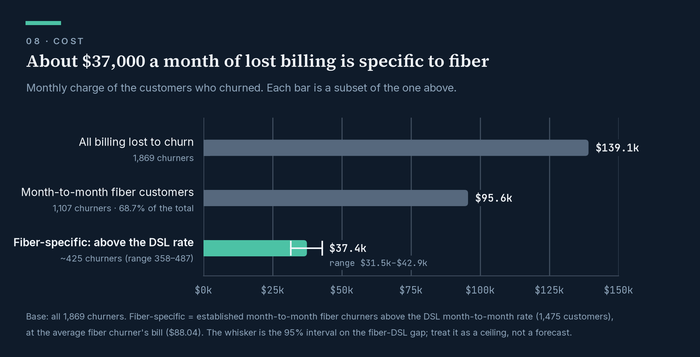
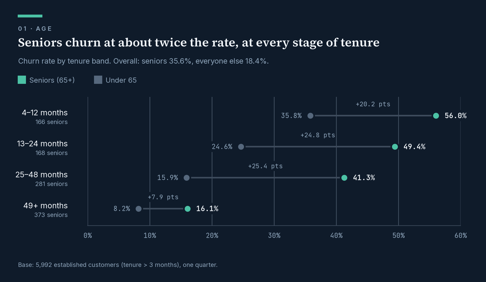
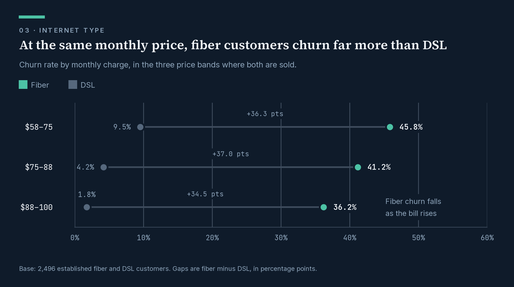
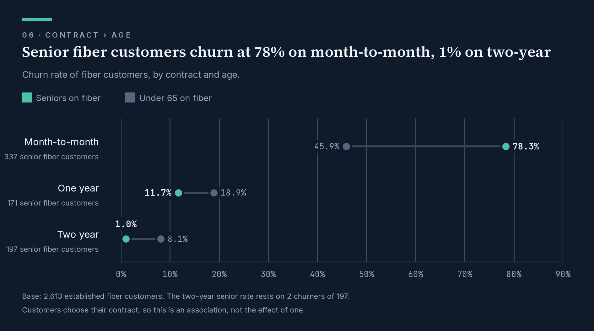

{#fig-cost fig-alt="Bar chart of monthly billing lost to churn. All billing lost: $139.1k a month. Month-to-month fiber customers: $95.6k, 68.7% of the total. Fiber-specific churn above the DSL rate: $37.4k a month, range $31.5k to $42.9k."}

## At a glance

| | |
| --- | --- |
| **The question** | Why are a telecom company's customers leaving, and what does it cost to do nothing? |
| **What I found** | Fiber customers on month-to-month contracts carry **68.7% of the monthly billing lost to churn**. They leave for competitors, not over price: at the *same* monthly bill, fiber customers churn 34–37 points more than DSL customers. |
| **What it's worth** | About **\$37,000 a month** of lost billing is tied specifically to fiber (@fig-cost) — up to roughly **\$450,000 a year**. |
| **What I recommended** | Don't answer with discounts. Find out what competitors offer fiber customers, and test a contract offer against a control group before rolling anything out. |
| **What I built** | A tested data pipeline (SQL, dbt, BigQuery), the statistical analysis (Python), a written data story, and the plans and data models for a Tableau story and a Power BI dashboard. |
| **Data** | One quarter of a telecom customer book: 7,043 customers, 1,869 of whom left. |

## Read the work

| | Deliverable | Status |
| --- | --- | --- |
| 📄 | **[The data story](docs/story.md)** — the full argument in six sections, from who leaves to what to do about it | Complete |
| 📊 | **Tableau story** — the same argument as a presented readout | [Build plan](docs/tableau_story_plan.md) · data models built and tested |
| 📈 | **Power BI dashboard** — self-serve analysis for repeat use | [Build plan](docs/powerbi_dashboard_plan.md) · data models built and tested |

::: {.callout-tip appearance="simple"}
## If you have five minutes
Read the [data story](docs/story.md). It is the project in the form a
decision-maker would receive it.
:::

## How I work

**I start from the decision, not the data.** The story opens with what should
be done, who owns it and by when. Every chart has to earn its place by moving
that argument forward.

**I test the obvious explanation before accepting it.** Fiber is the premium
product, so price looked like the answer. Comparing customers at the same
monthly bill showed the opposite: the gap got *bigger*, not smaller. That one
check turned the recommendation away from discounts.

**I don't let a good story outrun the evidence.** The most striking number here
— senior fiber customers on two-year contracts churn at 1.0% — rests on 2
people out of 197. The story says so. Every figure states which customers it
covers, every gap has a confidence range, and I'm explicit that these are
associations, not proven causes. That's why the recommendations are tests,
not rollouts.

**I catch problems before they reach a dashboard.** The source data marks
"no internet" with the text `'none'` rather than leaving it blank. Standard
null handling silently dropped **1,274 customers** until I traced it. I also
wrote a check that fails loudly if the published numbers ever drift from the
story's.

**I match the format to the audience.** The same analysis becomes three
things: a written story for decision-makers, a linear Tableau readout for a
meeting, and a Power BI dashboard for analysts who will return to it with
their own questions.

## Skills demonstrated

| Skill | Where to see it |
| --- | --- |
| **SQL and data modelling** — staging and mart layers, star schema, reusable macros | [`models/`](models/), [`macros/`](macros/) |
| **Data quality and testing** — 31 automated tests, including a story-parity check | [`tests/`](tests/), model YAML files |
| **Statistical analysis** — confidence intervals, confounder adjustment, interaction tests | [`notebooks/Eda.ipynb`](notebooks/Eda.ipynb) |
| **Data storytelling** — a structured narrative ending in owned, dated recommendations | [`docs/story.md`](docs/story.md) |
| **Data visualisation** — branded charts, colour-blind-safe palette validated by test | [`docs/img/`](docs/img/), [`notebooks/story_charts.py`](notebooks/story_charts.py) |
| **BI and dashboard design** — Tableau and Power BI plans, DAX measures, themes | [Tableau plan](docs/tableau_story_plan.md), [Power BI plan](docs/powerbi_dashboard_plan.md) |
| **Documentation** — every modelling decision and every analytical question logged | [Decision log](docs/decision_logs.md), [analytics log](docs/analytics_logs.md) |

**Tools:** SQL · BigQuery · dbt · Python (pandas, statsmodels, matplotlib) ·
Jupyter · Tableau · Power BI · DAX · Git · Quarto

## The finding, in three charts

::: {.panel-tabset}

### 1 · Who

Seniors churn at twice the rate — at every stage of their time with the
company (@fig-age).

{#fig-age fig-alt="Dot chart of churn rate for seniors and under-65 customers in four tenure bands. Seniors churn more in every band: 56.0% against 35.8% at 4 to 12 months, falling to 16.1% against 8.2% at 49 months and over."}

### 2 · What

Seven in ten seniors are on fiber, and fiber loses customers at any price.
Within fiber, churn even *falls* as the bill rises (@fig-price).

{#fig-price fig-alt="Dot chart of fiber and DSL churn in three price bands. At $58 to $75, fiber 45.8% against DSL 9.5%; at $75 to $88, 41.2% against 4.2%; at $88 to $100, 36.2% against 1.8%."}

### 3 · Where

It all bites on month-to-month contracts, where 337 senior fiber customers
churn at 78.3% (@fig-contract).

{#fig-contract fig-alt="Dot chart of fiber customers' churn rate by contract. Seniors: 78.3% on month-to-month, 11.7% on one-year, 1.0% on two-year. Under 65: 45.9%, 18.9% and 8.1%."}

:::

## Under the hood

::: {.callout-note collapse="true"}
## For technical reviewers: pipeline, method and repository

```{mermaid}
%%| label: fig-lineage
%%| fig-cap: "From raw data to both dashboards."
flowchart LR
    A[("Raw CSVs")] --> B[("BigQuery<br/>raw tables")]
    B --> C["dbt staging<br/>clean · typed · tested"]
    C --> D["fct_customer_churn<br/>one row per customer"]
    C --> F["dim_geography"]
    D --> G["rpt_story_segments<br/>+ cost estimates"]
    D --> PBI{{"Power BI<br/>dashboard"}}
    F --> PBI
    G --> TAB{{"Tableau<br/>story"}}
    C -.-> NB["Python analysis"] -.-> S["Data story"]
```

- **One shared customer table, with a separate layer for each tool.** Power BI
  gets a star schema to slice freely. Tableau gets pre-computed exhibits,
  because it cannot calculate the confidence intervals the story uses, and its
  numbers must match the written story to the decimal.
- **Confidence intervals in SQL** (Wilson and Newcombe), matching the Python
  analysis exactly: [`macros/confidence_intervals.sql`](macros/confidence_intervals.sql).
- **Both dashboards declared as dbt exposures,** so the lineage shows what
  feeds each one: [`models/marts/_exposures.yml`](models/marts/_exposures.yml).
- **Method.** The main analysis covers the 5,992 customers past their first
  three months; the first three months hold no "stayed" customers, so they are
  reported separately. Each effect was checked against its obvious confounder
  with Mantel-Haenszel pooled comparisons, direct standardisation, Kitagawa
  decomposition and likelihood-ratio tests for interaction. The data is one
  quarter, cross-sectional: no trends, and no causal claims.

```text
models/      staging views and marts, one YAML per model
macros/      confidence intervals
tests/       story-parity test
notebooks/   Eda.ipynb (analysis) · story_charts.py (rebuilds every chart)
docs/        the data story, both dashboard plans, the logs, charts
seeds/       the five raw CSVs
```
:::

::: {.callout-note collapse="true"}
## Run it yourself

**Needs:** Python 3.13, a Google Cloud project with BigQuery, and a
service-account key.

1. Upload the five CSVs in `seeds/` to a BigQuery dataset named `telco_churn`
   as `raw_demographics`, `raw_services`, `raw_status`, `raw_location` and
   `raw_population`, keeping the original column headers.
2. Replace the GCP project ID in `models/staging/_telco__sources.yml`,
   `notebooks/Eda.ipynb` and `notebooks/story_charts.py`.
3. Install and build:

::: {.panel-tabset}

#### macOS / Linux

```bash
python -m venv dbt_attrition
source dbt_attrition/bin/activate
pip install -r requirements.txt
dbt deps && dbt build
```

#### Windows (PowerShell)

```powershell
python -m venv dbt_attrition
.\dbt_attrition\Scripts\Activate.ps1
pip install -r requirements.txt
dbt deps; dbt build
```

:::

4. Add a `telco_churn` BigQuery profile to `~/.dbt/profiles.yml`, and a `.env`
   with `GOOGLE_APPLICATION_CREDENTIALS=<path-to-key.json>` for the notebook.
:::

## About me

I'm **Adejori Eniola Emmanuel**, a data analyst working across the whole path
from raw data to decision: modelling it, testing it, analysing it, and
explaining what it means to the people who have to act on it.

**[GitHub @aDataMage](https://github.com/aDataMage)** · **[LinkedIn](<your-linkedin-url>)** · **[Portfolio](<your-portfolio-url>)**
