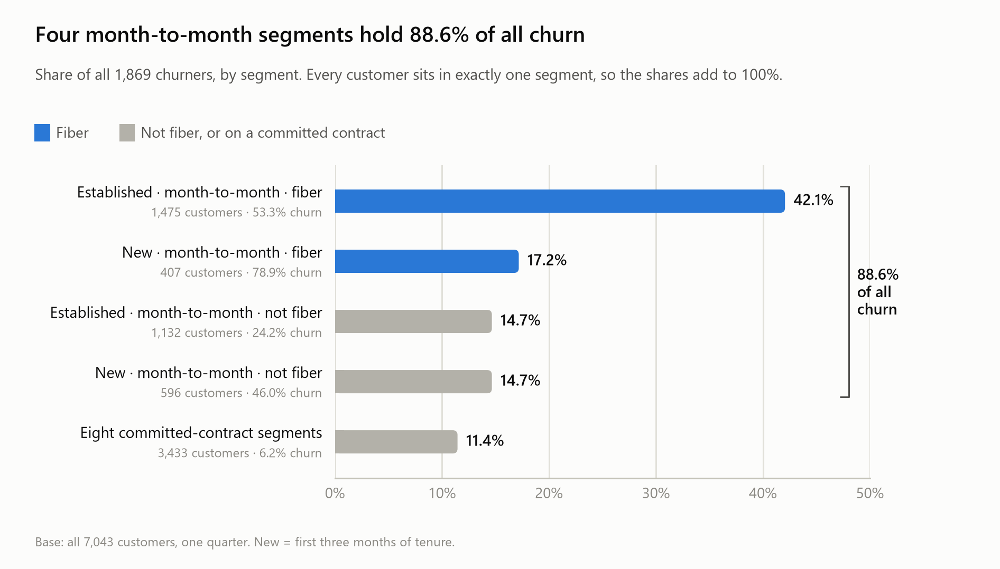
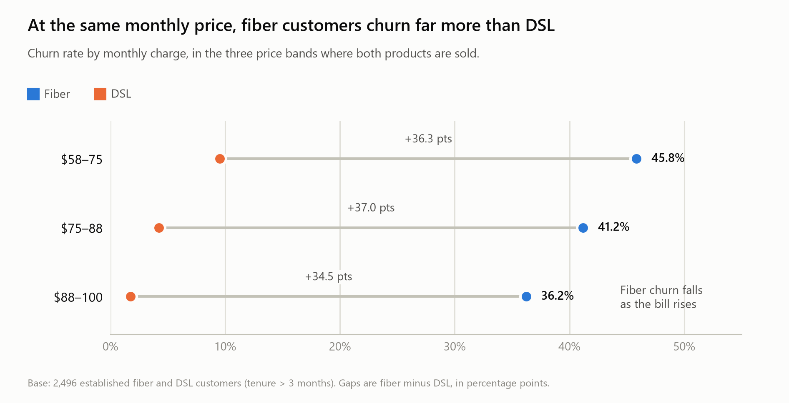
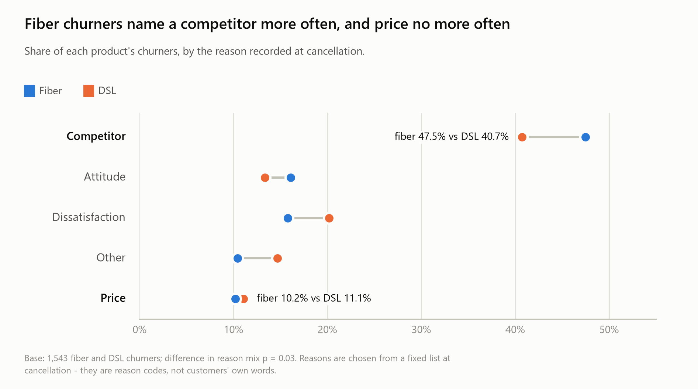
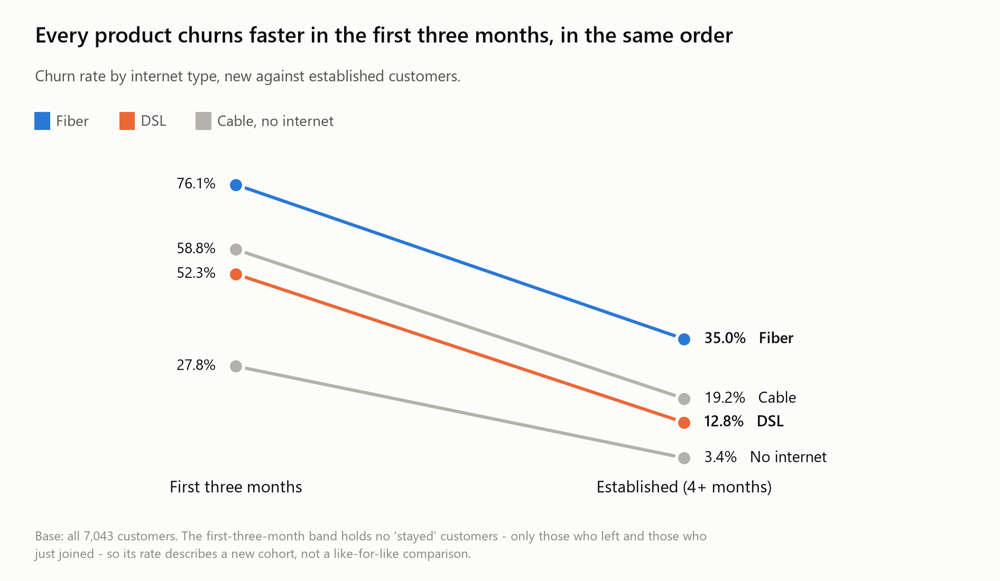
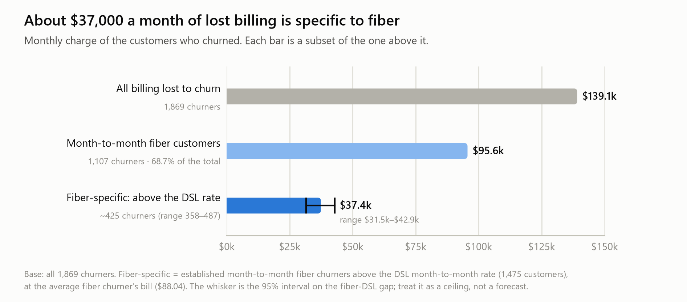

# Fiber customers on month-to-month contracts are two-thirds of the billing lost to churn — and price is not why they leave

<!-- SIGNAL: Landing, moved to the top (memo form). Pattern: theme preview, resolved. -->

## Bottom line

More than two of every three dollars of monthly billing lost to churn this quarter
left with one kind of customer: fiber broadband on a month-to-month contract.
These customers churn at over twice the DSL rate on the same contract, at the same
age, from their first month, and even at the same monthly price. When they leave,
they name a competitor more often than DSL customers do and price no more often.
Fiber churn should not be treated as a pricing problem. The work is to find out
what competitors are offering fiber customers that we are not.

**The asks**

1. **Do not answer fiber churn with blanket discounts.** Nothing in this data
   supports it: at the same price, fiber customers churn far more than DSL
   customers, and within fiber, churn falls as the bill rises.
   Owner: `[name]` · Decide by: `[date]`
2. **Pull the competitor detail behind fiber cancellations**: which competitor,
   and which device or offer, from cancellation records or retention-call notes.
   This dataset holds reason codes but no customer verbatims, and the story
   cannot be closed without them.
   Owner: `[name]` · Report by: `[date]`
3. **Test a one-year contract offer on month-to-month fiber accounts, with a
   holdout group.** Committed fiber customers churn at about a third of the
   month-to-month rate (16.8% against 53.3%), but customers who choose contracts
   may differ from those who don't. Only a test can tell those two explanations apart.
   Owner: `[name]` · Launch by: `[date]`

---

<!-- SIGNAL: Setting. Pattern: theme preview (body follows this order). -->

## What this covers

This memo covers where churn concentrates, which customers drive it and why
price does not explain them, how early it starts, and what leaving it alone
costs.

The data is one quarter of a telecom customer book: **7,043 customers, of whom
1,869 churned (26.5%)**. It is a single snapshot with no time dimension, so every
finding here is an association measured across customers, not a trend over time.
Two populations sit inside it and are reported separately where it matters:
1,051 customers in their first three months, who churn at 56.8%, and 5,992
established customers, who churn at 21.2%. Every figure below states its base.
The full working is in `notebooks/Eda.ipynb` and `docs/analytics_logs.md`.

---

<!-- SIGNAL: Guilty party (context). Pattern: taxonomic. -->

## Four month-to-month segments hold 88.6% of all churn

Split the whole book once, by tenure, then contract, then whether the customer
has fiber, and every customer lands in exactly one of twelve segments. Four of
the twelve account for nearly all the churn. All four are month-to-month.

*Exhibit 1.*

<picture>
  <source media="(prefers-color-scheme: dark)" srcset="img/01_churn_concentration_dark.png">
  
</picture>

Table view

*Base: all 7,043 customers, 1,869 churners.*

| Segment | Customers | Churn rate | Share of all churn | Cumulative |
| --- | --: | --: | --: | --: |
| Established · month-to-month · fiber | 1,475 | 53.3% | 42.1% | 42.1% |
| New (0–3 months) · month-to-month · fiber | 407 | 78.9% | 17.2% | 59.2% |
| Established · month-to-month · not fiber | 1,132 | 24.2% | 14.7% | 73.9% |
| New (0–3 months) · month-to-month · not fiber | 596 | 46.0% | 14.7% | 88.6% |
| The other eight segments (all on one- or two-year contracts) | 3,433 | 6.2% | 11.4% | 100.0% |

Month-to-month customers are half the book (51.3%) and 88.6% of its churn.
Fiber accounts for the larger share of that: the two fiber segments together are
26.7% of customers and 59.2% of churn.

Contract is the first cut that matters. But month-to-month means customers are
free to leave. It does not tell us why they do. The more useful question is why
fiber customers leave so much more often than other customers who are just as
free to go.

---

<!-- SIGNAL: Guilty party + Narrow in. Pattern: anchoring (mechanism not established
     — no linking), then Thought, then Speech. -->

## Fiber loses customers that DSL keeps, even at the same price

Fiber customers churn at 35.0% against 12.8% for DSL (*base: 4,024 established
fiber and DSL customers*). The gap holds on every contract: 53.3% against 24.5%
on month-to-month, 16.8% against 8.9% on one-year, 5.6% against 2.0% on two-year.
Across contracts, fiber churns 2.15 times as often (Mantel-Haenszel; odds ratio
3.10, 95% CI 2.57–3.73). The gap holds for seniors and non-seniors alike (2.60
times, pooled). It also holds in the first three months as it does later: fiber
is 23.8 points above DSL among new customers and 22.2 points above among
established ones.

The obvious explanation is price. Fiber is the premium product, and I expected
the gap to shrink once customers were compared at the same monthly bill.
It widened instead.

*Exhibit 2.*

<picture>
  <source media="(prefers-color-scheme: dark)" srcset="img/02_price_bands_dark.png">
  
</picture>

Table view

*Base: 2,496 established fiber and DSL customers in the three price bands where
both products are sold.*

| Monthly charge | Fiber churn | DSL churn | Gap (95% CI) |
| --- | --: | --: | --: |
| $58–75 | 45.8% | 9.5% | +36.3 pts (29.1–43.4) |
| $75–88 | 41.2% | 4.2% | +37.0 pts (32.0–41.3) |
| $88–100 | 36.2% | 1.8% | +34.5 pts (26.3–38.0) |

Compared at the same price, the gap is larger than the unadjusted 22 points, not
smaller. Within fiber, churn *falls* as the bill rises: 45.8%, 41.2%, 36.2%
across the same three bands. Whatever is driving fiber customers out, it does not
look like simple price sensitivity.

The cancellation records point the same way. When a customer cancels, the reason
is recorded from a fixed list. Across the 1,272 established churners, the two
most common entries are:

> "competitor had better devices" (207)
>
> "competitor made better offer" (204)

Nearly half of all cancellations (45.4%) fall under a competitor reason. "Price
too high" is recorded 53 times. Fiber churners cite a competitor more often than
DSL churners do (47.5% against 40.7%). They cite price no more often (10.2%
against 11.1%). *Base: 1,543 fiber and DSL churners; difference in reason mix
p = 0.03.*

*Exhibit 3.*

<picture>
  <source media="(prefers-color-scheme: dark)" srcset="img/03_churn_reasons_dark.png">
  
</picture>

Table view

*Base: 1,543 churners - 1,236 fiber, 307 DSL. Shares of each product's churners.*

| Reason category | Fiber | DSL | Difference |
| --- | --: | --: | --: |
| Competitor | 47.5% | 40.7% | +6.8 pts |
| Attitude | 16.1% | 13.4% | +2.7 pts |
| Dissatisfaction | 15.8% | 20.2% | −4.4 pts |
| Other | 10.4% | 14.7% | −4.3 pts |
| Price | 10.2% | 11.1% | −0.9 pts |

These are reason codes, not customers' own words. The dataset holds no
verbatims. The codes say *who* customers left for. They do not say *what* the
competitor offered on fiber that we did not. That is where this story is still
incomplete, and it is why the second ask exists.

---

<!-- SIGNAL: Narrow in, continued. Pattern: anchoring. -->

## The same customers leave from the first month, only faster

New customers churn at 56.8% in their first three months (*base: 1,051. This band
contains no "stayed" customers, only those who left and those who have just
joined, so this is the churn rate of a new cohort*). The drivers are the same.
Contract, internet type, payment method and age each move churn in the same
direction in the first three months as afterwards. For none of the four is the
difference between the two periods statistically distinguishable, though two come
close (internet type and age, both p = 0.06). Early leavers also give the same
reasons as later ones (*base: 1,869 churners; difference in mix p = 0.40*).

*Exhibit 4.*

<picture>
  <source media="(prefers-color-scheme: dark)" srcset="img/04_first_months_dark.png">
  
</picture>

Table view

*Base: all 7,043 customers - 1,051 in their first three months, 5,992 established.*

| Internet type | First three months | Established (4+ months) |
| --- | --: | --: |
| Fiber | 76.1% (422) | 35.0% (2,613) |
| Cable | 58.8% (136) | 19.2% (694) |
| DSL | 52.3% (241) | 12.8% (1,411) |
| No internet | 27.8% (252) | 3.4% (1,274) |

The highest churn rate in the book is in this group: new month-to-month fiber
customers. There are 407 of them, and 78.9% left. On this evidence, early churn
does not look like a separate onboarding problem. It looks like the same problem
arriving sooner.

---

<!-- SIGNAL: Ante. Pattern: taxonomic. -->

## Leaving it alone costs about $37,000 a month in fiber-specific churn

The cost breaks down into three parts.

*Exhibit 5.*

<picture>
  <source media="(prefers-color-scheme: dark)" srcset="img/05_cost_of_inaction_dark.png">
  
</picture>

Table view

*Base: all 1,869 churners. The fiber-specific row covers the 1,475 established
month-to-month fiber customers.*

| Layer | Churners | Monthly billing lost |
| --- | --: | --: |
| All billing lost to churn | 1,869 | $139,131 |
| Month-to-month fiber customers | 1,107 | $95,594 |
| Fiber-specific: above the DSL month-to-month rate | ~425 (358–487) | $37,378 ($31,493–$42,879) |

**Billing already lost.** The month-to-month fiber customers who churned were
billing $95,594 a month between them. That is 68.7% of the $139,131 a month lost
to churn across the whole book (*base: all 1,869 churners*). This is actual
billing from the `monthly_charge` field, not an estimate.

**The part attributable to fiber.** Not all of that is recoverable, because
month-to-month DSL customers churn too (24.5% among established customers). If
the 1,475 established month-to-month fiber customers had churned at the DSL rate,
about **425 fewer would have left**, somewhere between 358 and 487 given the
uncertainty on the gap. At the average fiber churner's bill of $88.04, that is
about **$37,400 a month** (range $31,500–$42,900).

**The horizon.** Over twelve months, that comes to roughly **$450,000** (range
$380,000–$515,000). Twelve months is an assumption about how long those customers
would otherwise have stayed. It is not a measurement.

Two cautions keep this honest. The fiber–DSL gap is an association. Some of it
may reflect who chooses fiber rather than anything fiber itself does, so treat
the range as a ceiling on what a fiber-specific fix could recover, not a forecast.
With one quarter of data, I also cannot show the loss growing over time. What I
can show is that it repeats every month a lost customer stays gone, and that it
starts early. Customers who leave in their first three months were billing $61.02
a month on average, against $80.74 for those who leave later. They leave before
they have been upsold.

---

## Appendix

### How to read the figures

- Every churn rate is churners ÷ customers in that segment, and every table and
  paragraph states its base.
- Rates carry Wilson 95% intervals and differences carry Newcombe intervals.
  "Pooled" comparisons are Mantel-Haenszel, which compares groups within each
  level of a second variable and then combines the results. Tests of whether an
  effect differs across groups use Breslow-Day and likelihood-ratio tests.
  Differences in reason mix use chi-square.
- Monthly charges are in US dollars. The customer book is entirely in California.
- The working, including every table cited here, is in `notebooks/Eda.ipynb`.
  The question-by-question findings are in `docs/analytics_logs.md`.

### What was examined and left out of this story

These cuts were run and are documented in the analytics log. They were left out
because they do not change the argument above.

- **Seniors on month-to-month contracts.** This is the strongest finding not
  carried here and deserves a story of its own. Seniors on month-to-month churn at
  77.3% against 33.8% for non-seniors on the same contract, with no senior effect
  at all on committed contracts. They are 410 customers and 24.9% of established
  churn.
- **Payment method.** Credit-card payers churn less (11.3% against 28.2% for bank
  withdrawal, established customers). Part of that is contract mix. The rest does
  not change the fiber story.
- **Paperless billing.** Paperless customers churn at 27.7% against 11.7%, but 54%
  of that gap is internet type, and among customers with no internet it
  disappears (+0.2 points). It is a marker of the fiber customer, not a lever.
- **Add-ons.** Churn falls steadily with each add-on (46.7% with none, 5.3% with
  four, internet customers). Within fiber, each add-on adds about $7 to the
  monthly bill, so add-on effects and price effects cannot be separated there.
- **Streaming, engagement and gender.** Each has little or no effect on churn.
- **Geography.** Cities are too small to rank (1,105 cities, median 4 customers
  each). Urban zip codes churn more than rural ones (25.0% against 19.0%). This
  was not pursued further here.

### Caveats

- **Association, not cause.** Every finding here is cross-sectional. Customers
  choose their contract and their product, so differences between groups may
  reflect who chooses rather than what the choice does. That is why ask 3 is a
  test with a holdout group, not a rollout.
- **No time dimension.** The data is one quarter. Trends, seasonality and
  compounding cannot be measured from it.
- **Reason codes are categories.** They are chosen from a fixed list at
  cancellation, not recorded in the customer's own words, and they exist only for
  customers who churned.
- **The 0–3 month band is a different population.** It contains no customers with
  "stayed" status, so its churn rate is not directly comparable with the
  established book's.
- **The 12-month revenue figures assume a horizon.** The monthly figures are
  actual billing. Multiplying them by twelve assumes those customers would have
  stayed a year.
