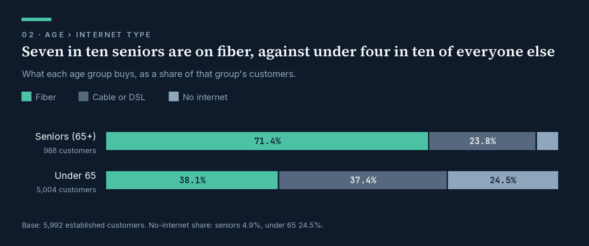
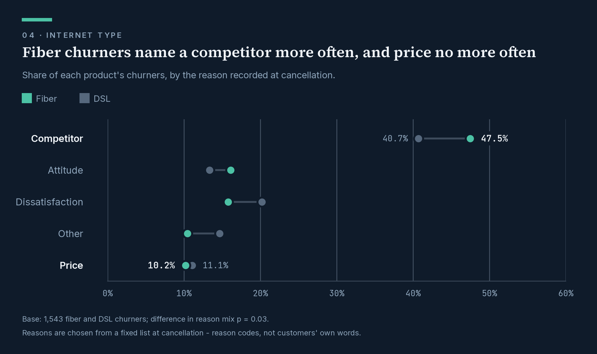
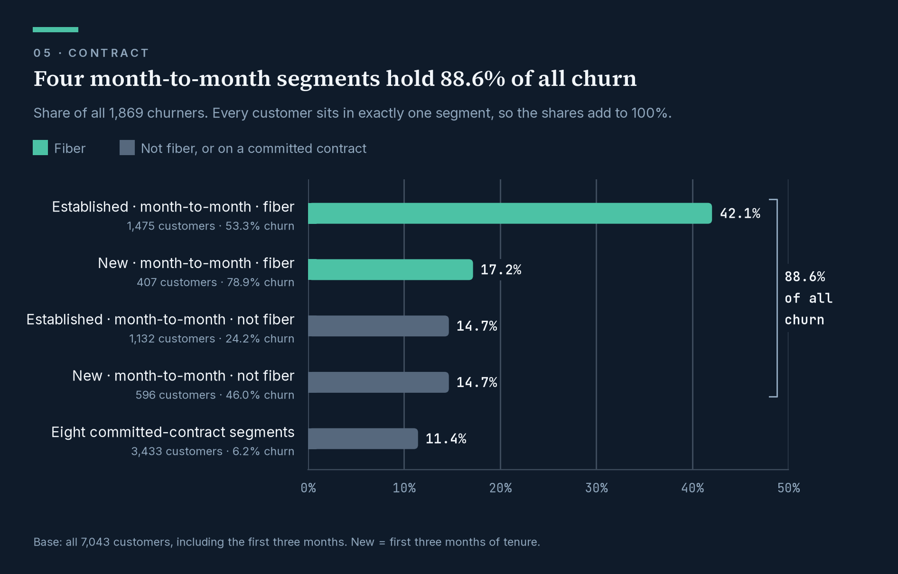
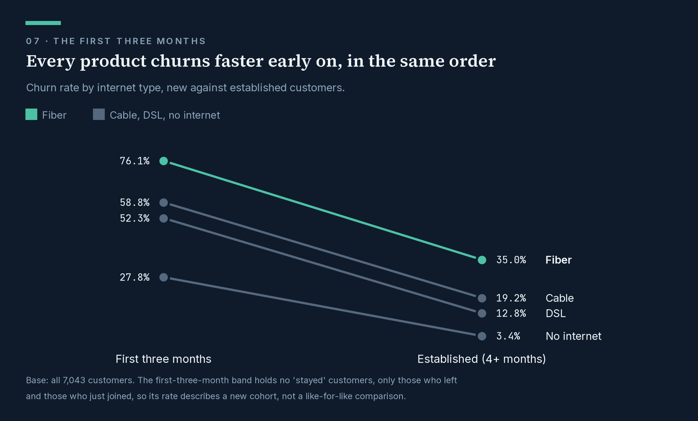

# Fiber customers on month-to-month contracts are two-thirds of the billing lost to churn — and price is not why they leave

<!-- SIGNAL: Landing, moved to the top (memo form). Pattern: theme preview, resolved. -->

## Bottom line

More than two of every three dollars of monthly billing lost to churn this quarter
left with one kind of customer: fiber broadband on a month-to-month contract.
These customers churn at over twice the DSL rate on the same contract, at the same
age, from their first month, and even at the same monthly price. When they leave,
they name a competitor more often than DSL customers do and price no more often.

Age sharpens the picture. Seniors churn at twice the rate of everyone else, and
seven in ten of them are on fiber. Their extra churn appears only on
month-to-month contracts, where 337 senior fiber customers churn at 78.3%.

Fiber churn should not be treated as a pricing problem. The work is to find out
what competitors are offering fiber customers that we are not.

**The asks** (set out with owners, deadlines and three more under [Recommendations](#6-recommendations))

1. **Do not answer fiber churn with blanket discounts.** Nothing in this data
   supports it: at the same price, fiber customers churn far more than DSL
   customers, and within fiber, churn falls as the bill rises.
2. **Pull the competitor detail behind fiber cancellations**: which competitor,
   and which device or offer, from cancellation records or retention-call notes.
   This dataset holds reason codes but no customer verbatims, and the story
   cannot be closed without them.
3. **Test a one-year contract offer on month-to-month fiber accounts, with a
   holdout group, starting with senior fiber customers.** Committed fiber
   customers churn at about a third of the month-to-month rate (16.8% against
   53.3%), and for seniors the difference is starker (11.7% against 78.3%). But
   customers who choose contracts may differ from those who don't. Only a test can
   tell those two explanations apart.

---

<!-- SIGNAL: Setting. Pattern: theme preview (body follows this order). -->

## What this covers

This memo follows churn through three questions in turn: who leaves (age), what
they bought and why price does not explain it (internet type), and what was
holding them (contract). It then covers how early churn starts, what leaving it
alone costs, and the possible recommendations that follow.

The data is one quarter of a telecom customer book: **7,043 customers, of whom
1,869 churned (26.5%)**. It is a single snapshot with no time dimension, so every
finding here is an association measured across customers, not a trend over time.
Two populations sit inside it and are reported separately where it matters:
1,051 customers in their first three months, who churn at 56.8%, and 5,992
established customers, who churn at 21.2%. Every figure below states its base.
The full working is in `notebooks/Eda.ipynb` and `docs/analytics_logs.md`.

---

<!-- SIGNAL: Interruption / Guilty party (who). Pattern: anchoring. -->

## 1. Seniors churn at twice the rate, and seven in ten of them are on fiber

*Exhibit 1.*

Table view

*Base: 5,992 established customers (988 seniors, 5,004 under 65).*

| Tenure | Seniors | Under 65 | Gap |
| --- | --: | --: | --: |
| 4–12 months | 56.0% (166) | 35.8% (969) | +20.2 pts |
| 13–24 months | 49.4% (168) | 24.6% (856) | +24.8 pts |
| 25–48 months | 41.3% (281) | 15.9% (1,313) | +25.4 pts |
| 49+ months | 16.1% (373) | 8.2% (1,866) | +7.9 pts |
| All | 35.6% (988) | 18.4% (5,004) | +17.2 pts |

Seniors (65 and over) churn at 35.6%, against 18.4% for everyone else: 1.94 times
the rate (*base: 5,992 established customers*). They are 16.5% of established
customers and 27.7% of established churn. The gap holds at every stage of tenure,
from the first year (+20.2 points) to five years and beyond (+7.9 points). Tenure
is not what makes the difference: at a common tenure mix the gap is 17.8 points
(95% CI 14.7–20.8). Household explains part of it. Seniors are married at the same
rate as everyone else, but far fewer have dependents (7.2% against 28.7%).
Marriage and dependents combined account for about a quarter of the gap (4.3 of
the 17.2 points).

*Exhibit 2.*

Table view

*Base: 5,992 established customers. Shares of each age group's customers.*

| Product | Seniors (988) | Under 65 (5,004) |
| --- | --: | --: |
| Fiber | 71.4% | 38.1% |
| Cable | 8.1% | 12.3% |
| DSL | 15.7% | 25.1% |
| No internet | 4.9% | 24.5% |

What seniors buy carries more of it. 71.4% of seniors are on fiber, against 38.1%
of everyone else. Only 4.9% of seniors take phone service without internet,
against 24.5% of everyone else, and phone-only customers barely churn. Among DSL
and fiber customers, product mix accounts for 4.6 of the 12.1 points between
seniors and everyone else, about 38% (*base: 4,024 DSL and fiber customers*). So
the senior story leads straight into the fiber story.

---

<!-- SIGNAL: Guilty party + Narrow in. Pattern: anchoring (mechanism not established
     — no linking), then Thought, then Speech. -->

## 2. Fiber loses customers that DSL keeps, even at the same price

Fiber customers churn at 35.0% against 12.8% for DSL (*base: 4,024 established
fiber and DSL customers*). The gap holds on every contract: 53.3% against 24.5%
on month-to-month, 16.8% against 8.9% on one-year, 5.6% against 2.0% on two-year.
Across contracts, fiber churns 2.15 times as often (Mantel-Haenszel; odds ratio
3.10, 95% CI 2.57–3.73). The gap holds for seniors and non-seniors alike (2.60
times, pooled): seniors on fiber churn at 40.6% against 19.4% on DSL, and
under-65s at 33.0% against 12.0%. It also holds in the first three months as it
does later: fiber is 23.8 points above DSL among new customers and 22.2 points
above among established ones.

The obvious explanation is price. Fiber is the premium product, and I expected
the gap to shrink once customers were compared at the same monthly bill.
It widened instead.

*Exhibit 3.*

Table view

*Base: 2,496 established fiber and DSL customers in the three price bands where
both products are sold.*

| Monthly charge | Fiber churn | DSL churn | Gap (95% CI) |
| --- | --: | --: | --: |
| $58–75 | 45.8% | 9.5% | +36.3 pts (29.1–43.4) |
| $75–88 | 41.2% | 4.2% | +37.0 pts (32.0–41.3) |
| $88–100 | 36.2% | 1.8% | +34.5 pts (26.3–38.0) |

Compared at the same price, the gap is larger than the unadjusted 22 points, not
smaller. Within fiber, churn *falls* as the bill rises: 45.8%, 41.2%, 36.2%
across the same three bands. Whatever is driving fiber customers out, it does not
look like simple price sensitivity.

The cancellation records point the same way. When a customer cancels, the reason
is recorded from a fixed list. Across the 1,272 established churners, the two
most common entries are:

> "competitor had better devices" (207)
>
> "competitor made better offer" (204)

Nearly half of all cancellations (45.4%) fall under a competitor reason. "Price
too high" is recorded 53 times. Fiber churners cite a competitor more often than
DSL churners do (47.5% against 40.7%). They cite price no more often (10.2%
against 11.1%). *Base: 1,543 fiber and DSL churners; difference in reason mix
p = 0.03.*

*Exhibit 4.*

Table view

*Base: 1,543 churners - 1,236 fiber, 307 DSL. Shares of each product's churners.*

| Reason category | Fiber | DSL | Difference |
| --- | --: | --: | --: |
| Competitor | 47.5% | 40.7% | +6.8 pts |
| Attitude | 16.1% | 13.4% | +2.7 pts |
| Dissatisfaction | 15.8% | 20.2% | −4.4 pts |
| Other | 10.4% | 14.7% | −4.3 pts |
| Price | 10.2% | 11.1% | −0.9 pts |

These are reason codes, not customers' own words. The dataset holds no
verbatims. The codes say *who* customers left for. They do not say *what* the
competitor offered on fiber that we did not. That is where this story is still
incomplete, and it is why the second ask exists.

---

<!-- SIGNAL: Guilty party (context). Pattern: taxonomic, then anchoring. -->

## 3. Four month-to-month segments hold 88.6% of all churn

Split the whole book once, by tenure, then contract, then whether the customer
has fiber, and every customer lands in exactly one of twelve segments. Four of
the twelve account for nearly all the churn. All four are month-to-month.

*Exhibit 5.*

Table view

*Base: all 7,043 customers, 1,869 churners.*

| Segment | Customers | Churn rate | Share of all churn | Cumulative |
| --- | --: | --: | --: | --: |
| Established · month-to-month · fiber | 1,475 | 53.3% | 42.1% | 42.1% |
| New (0–3 months) · month-to-month · fiber | 407 | 78.9% | 17.2% | 59.2% |
| Established · month-to-month · not fiber | 1,132 | 24.2% | 14.7% | 73.9% |
| New (0–3 months) · month-to-month · not fiber | 596 | 46.0% | 14.7% | 88.6% |
| The other eight segments (all on one- or two-year contracts) | 3,433 | 6.2% | 11.4% | 100.0% |

Month-to-month customers are half the book (51.3%) and 88.6% of its churn.
Fiber accounts for the larger share of that: the two fiber segments together are
26.7% of customers and 59.2% of churn.

Contract is the first cut that matters. But month-to-month means customers are
free to leave. It does not tell us why they do. Fiber is one answer to that
question, and age is the other. The senior effect exists *only* on
month-to-month. Seniors on month-to-month churn at 77.3%, against 33.8% for
everyone else on month-to-month. On committed contracts the difference
disappears: 11.1% against 10.7% on one-year, and 1.9% against 2.7% on two-year
(*base: 5,992 established customers*).

*Exhibit 6.*

Table view

*Base: 2,613 established fiber customers.*

| Contract | Seniors on fiber | Under 65 on fiber |
| --- | --: | --: |
| Month-to-month | 78.3% (264 of 337) | 45.9% (522 of 1,138) |
| One year | 11.7% (20 of 171) | 18.9% (78 of 412) |
| Two year | 1.0% (2 of 197) | 8.1% (29 of 358) |

Where the fiber and age effects meet, churn is at its highest. There are 337
senior fiber customers on month-to-month contracts, 5.6% of the established book.
They churn at 78.3% and account for 20.8% of all established churn. The same kind
of customer churns at 11.7% on a one-year contract and 1.0% on a two-year one,
though that last figure rests on 2 churners out of 197 (95% interval 0.3%–3.6%).

This is the strongest pattern in the data, and also the one most exposed to
selection. Customers choose their contract, and the seniors who sign for two years
may already be the ones who meant to stay. These rates show where the lever
*might* be, not that pulling it works. That is why the third ask is a test and not
a rollout.

---

<!-- SIGNAL: Narrow in, continued. Pattern: anchoring. -->

## 4. The same customers leave from the first month, only faster

New customers churn at 56.8% in their first three months (*base: 1,051. This band
contains no "stayed" customers, only those who left and those who have just
joined, so this is the churn rate of a new cohort*). The drivers are the same.
Contract, internet type, payment method and age each move churn in the same
direction in the first three months as afterwards. For none of the four is the
difference between the two periods statistically distinguishable, though two come
close (internet type and age, both p = 0.06). Early leavers also give the same
reasons as later ones (*base: 1,869 churners; difference in mix p = 0.40*).

*Exhibit 7.*

Table view

*Base: all 7,043 customers - 1,051 in their first three months, 5,992 established.*

| Internet type | First three months | Established (4+ months) |
| --- | --: | --: |
| Fiber | 76.1% (422) | 35.0% (2,613) |
| Cable | 58.8% (136) | 19.2% (694) |
| DSL | 52.3% (241) | 12.8% (1,411) |
| No internet | 27.8% (252) | 3.4% (1,274) |

The highest churn rate in the book is in this group: new month-to-month fiber
customers. There are 407 of them, and 78.9% left. Seniors show the same pattern
early: 80.5% of seniors in their first three months leave, against 52.7% of
everyone else (*base: 1,051*). On this evidence, early churn does not look like a
separate onboarding problem. It looks like the same problem arriving sooner.

---

<!-- SIGNAL: Ante. Pattern: taxonomic. -->

## 5. Leaving it alone costs about $37,000 a month in fiber-specific churn

*Exhibit 8.*

Table view

*Base: all 1,869 churners. The fiber-specific row covers the 1,475 established
month-to-month fiber customers.*

| Layer | Churners | Monthly billing lost |
| --- | --: | --: |
| All billing lost to churn | 1,869 | $139,131 |
| Month-to-month fiber customers | 1,107 | $95,594 |
| Fiber-specific: above the DSL month-to-month rate | ~425 (358–487) | $37,378 ($31,493–$42,879) |

The cost breaks down into three parts.

**Billing already lost.** The month-to-month fiber customers who churned were
billing $95,594 a month between them. That is 68.7% of the $139,131 a month lost
to churn across the whole book (*base: all 1,869 churners*). This is actual
billing from the `monthly_charge` field, not an estimate.

**The part attributable to fiber.** Not all of that is recoverable, because
month-to-month DSL customers churn too (24.5% among established customers). If
the 1,475 established month-to-month fiber customers had churned at the DSL rate,
about **425 fewer would have left**, somewhere between 358 and 487 given the
uncertainty on the gap. At the average fiber churner's bill of $88.04, that is
about **$37,400 a month** (range $31,500–$42,900).

Age adds a second, overlapping estimate. If the 337 senior fiber customers on
month-to-month had churned at the under-65 rate, about 109 fewer would have left
(range 91–126). At their average bill of $89.90, that is about $9,800 a month
(range $8,200–$11,300). This sits *inside* the fiber figure rather than on top of
it, so the two must not be added.

**The horizon.** Over twelve months, the fiber-specific figure comes to roughly
**$450,000** (range $380,000–$515,000), and the senior share within it to roughly
$118,000 (range $98,000–$136,000). Twelve months is an assumption about how long
those customers would otherwise have stayed. It is not a measurement.

Two cautions keep this honest. The fiber–DSL gap is an association. Some of it
may reflect who chooses fiber rather than anything fiber itself does, so treat
the range as a ceiling on what a fiber-specific fix could recover, not a forecast.
With one quarter of data, I also cannot show the loss growing over time. What I
can show is that it repeats every month a lost customer stays gone, and that it
starts early. Customers who leave in their first three months were billing $61.02
a month on average, against $80.74 for those who leave later. They leave before
they have been upsold.

---

<!-- SIGNAL: Landing, the ask expanded. -->

## 6. Recommendations

These follow from the evidence above and are graded by how strongly it supports
each one. None is proven to work: every finding here is an association, so each
recommendation comes with the test that would show whether it does. The first
three are the asks at the top of this memo.

**1. Do not answer fiber churn with blanket discounts.** A price cut is the reflex
response to the fiber gap, and the evidence runs against it. At the same monthly
price, fiber churns 34–37 points more than DSL. Within fiber, churn falls as the
bill rises. Fiber churners cite price no more often than DSL churners. That does
not show price never matters to anyone, only that it is not what separates fiber
from DSL. *If a discount is tried anyway,* run it head-to-head against a non-price
offer (recommendation 2 or 3) so the comparison is fair.

> **Owner:** Head of Marketing · **Decide by:** 7ᵗʰ October, 2026

**2. Find out what competitors are offering fiber customers, then answer it.** The
two most common cancellation reasons are "competitor had better devices" (207) and
"competitor made better offer" (204). Fiber churners name a competitor more often
than DSL churners do (47.5% against 40.7%). Possible responses include a
device-refresh offer at contract renewal, or a matching offer in the retention
conversation, but which one depends on what competitors are actually offering.
*The first step:* pull the competitor named and the offer described from
cancellation records or retention-call notes. Then pilot the most likely response
against a control group.

> **Owner:** Head of Strategic Research · **Decide by:** 1ˢᵗ October, 2026

**3. Offer month-to-month fiber customers a one-year contract, starting with
seniors.** Month-to-month holds 88.6% of all churn. Committed fiber customers
churn at about a third of the month-to-month rate, and the senior effect
disappears entirely on committed contracts. The sharpest case is the 337 senior
fiber customers on month-to-month, who churn at 78.3% against 11.7% for seniors on
fiber with a one-year contract. What the data cannot say is whether offering a
contract *causes* lower churn, or whether committed customers were simply stayers
to begin with. *To test it:* make the offer to a random half of the segment, hold
back the other half, and compare 90-day churn. Starting with seniors puts the test
where the gap is widest. The incentive has to cost less than what it keeps: the
average bill in this segment is $89.90 a month.

> **Owner:** Head of Data and Analytics · **Decide by:** 12ᵗʰ October, 2026

**4. Act in the first three months.** Customers in their first three months churn
at 56.8% (*base: 1,051*), with the same drivers as later. New month-to-month fiber
customers churn at 78.9% (*base: 407*), and new seniors at 80.5% (*base: 154*).
They also leave on smaller bills ($61.02 against $80.74), before any upsell.
*Possible actions:* an onboarding check-in in the first month, and a contract offer
before the first renewal. *To test it:* randomise the outreach by signup cohort.

> **Owner:** Head of Marketing (Onboarding Team) · **Decide by:** 10ᵗʰ October, 2026

**5. Review the support experience for senior customers.** Senior churners record
"attitude" as their reason more often than everyone else: 19.6% against 14.7%. The
attitude category is mostly "attitude of support person" (148 of its 204
established entries). It is the only reason category where the two age groups
differ beyond chance at the cell level (z = 2.1), and the overall reason mix does
*not* differ significantly (p = 0.23). This is worth a look, not an investment
case. *To test it:* review a sample of senior support interactions before
committing any budget.

> **Owner:** Head of Customer Relations · **Decide by:** 7ᵗʰ October, 2026

**6. Fix the data so the next round can test cause.** Three gaps limit what this
analysis could conclude. There are no customer verbatims. There is only one
quarter, so no trend can be measured. And there is no record of which retention
offers were made to whom, so no offer's effect can be measured. *Actions:* capture
a free-text cancellation reason and the competitor named, track customer cohorts
across quarters, and log every retention offer against the account. Without this,
the tests in recommendations 1 to 5 cannot be read.

> **Owner:** Head of Data and Analytics · **Decide by:** 10ᵗʰ October, 2026

---

## Appendix

### How to read the figures

- Every churn rate is churners ÷ customers in that segment, and every chart, table
  and paragraph states its base.
- Rates carry Wilson 95% intervals and differences carry Newcombe intervals.
  "Pooled" comparisons are Mantel-Haenszel, which compares groups within each
  level of a second variable and then combines the results. Tests of whether an
  effect differs across groups use Breslow-Day and likelihood-ratio tests.
  Differences in reason mix use chi-square.
- Monthly charges are in US dollars. The customer book is entirely in California.
- The charts are rebuilt from the data by `notebooks/story_charts.py`. The
  question-by-question findings are in `docs/analytics_logs.md`.

### What was examined and left out of this story

These cuts were run and are documented in the analytics log. They were left out
because they do not change the argument above.

- **Payment method.** Credit-card payers churn less (11.3% against 28.2% for bank
  withdrawal, established customers). Part of that is contract mix. The rest does
  not change the fiber story.
- **Paperless billing.** Paperless customers churn at 27.7% against 11.7%, but 54%
  of that gap is internet type, and among customers with no internet it
  disappears (+0.2 points). It is a marker of the fiber customer, not a lever.
- **Add-ons.** Churn falls steadily with each add-on (46.7% with none, 5.3% with
  four, internet customers). Within fiber, each add-on adds about $7 to the
  monthly bill, so add-on effects and price effects cannot be separated there.
- **Marriage and dependents.** Combined as a stability score, they account for a
  quarter of the senior gap (section 1), but only 7% of the contract gap and 7% of
  the fiber gap. The fiber gap survives, but its size does vary across stability
  levels (homogeneity p < 0.001). That is worth its own look and was not pursued
  here.
- **Streaming, engagement and gender.** Each has little or no effect on churn.
- **Geography.** Cities are too small to rank (1,105 cities, median 4 customers
  each). Urban zip codes churn more than rural ones (25.0% against 19.0%). This
  was not pursued further here.

### Caveats

- **Association, not cause.** Every finding here is cross-sectional. Customers
  choose their contract and their product, so differences between groups may
  reflect who chooses rather than what the choice does. That is why ask 3 is a
  test with a holdout group, not a rollout.
- **Small cells.** The two-year senior fiber rate (1.0%) rests on 2 churners of
  197. Cells under 100 customers are flagged in the analytics log.
- **No time dimension.** The data is one quarter. Trends, seasonality and
  compounding cannot be measured from it.
- **Reason codes are categories.** They are chosen from a fixed list at
  cancellation, not recorded in the customer's own words, and they exist only for
  customers who churned.
- **The 0–3 month band is a different population.** It contains no customers with
  "stayed" status, so its churn rate is not directly comparable with the
  established book's.
- **The 12-month revenue figures assume a horizon.** The monthly figures are
  actual billing. Multiplying them by twelve assumes those customers would have
  stayed a year.
